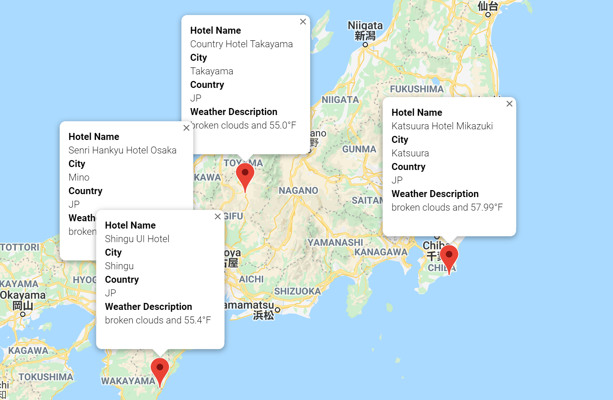

# World_Weather_Analysis

## Overview of the Analysis
This project provides users a recommendation on travel destination based on user’s temperature preference. Upon entering the temperature range, the user will get a map of different cities around the world that satisfy the temperature requirement. In addition, this project also provides a travel itinerary based on destinations. 

## Results
The user of this project would like to go somewhere cool with minimum temperature set at 60 °F to 75 °F for one week. Below is a map showing many cities within this temperature range. 

The user decides to go to the United States and therefore selected four cities to visit. Below are the travel itinerary and detailed information on each city. 

